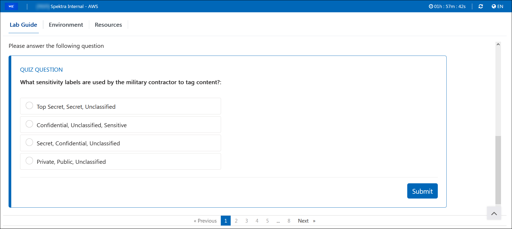
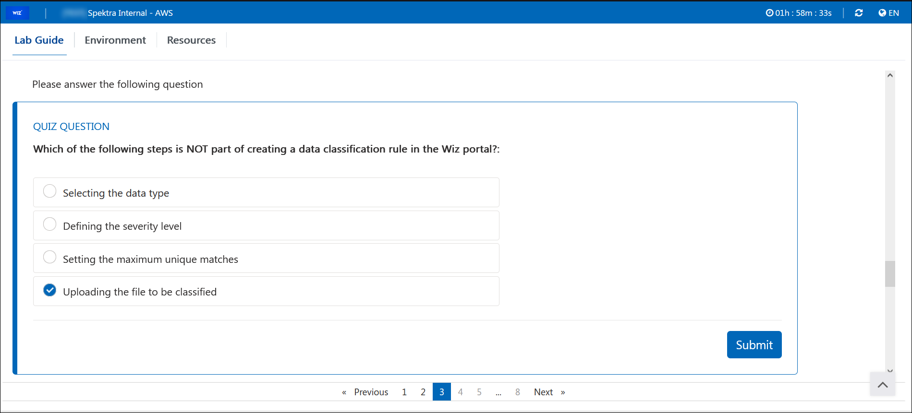
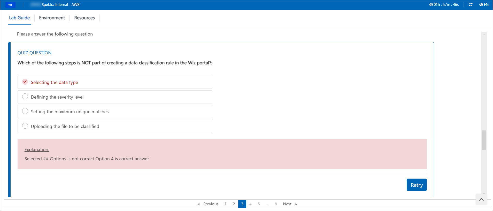

# Inline Lab Guide Question

Inline Lab Guide Questions feature provides ability to integrate an interactive Q&A module within Lab Guide.

The goal of this feature is to:

1.	Increase lab user engagement by introducing interactive elements in the lab guide. 

2.	Assess knowledge of lab user by providing questions in lab guide and grade user based on question scores. 

3.	Collection of valuable feedback from lab users to benefit both educators and CloudLabs. 

4.	Ability to force user to answer questions in current lab guide page to be able to move forward.

The feature supports two types of questions:

- **Single Choice**

- **Multiple Choice**

## Configuring OnDemand Lab with Inline Lab Guide Questions:

**Step 1: Enable Inline Questions in Template config:**

- To enable Inline Questions, we need to input master doc URL in Template config, which will make R**ender Inline Lab Guide Questions** checkbox visible.

- On tick of **Render Inline Lab Guide Questions** checkbox, the feature flag will get enabled in OnDemand lab config.

   

**Step 2: Enable Inline Questions in OnDemand lab config:**

- Once Inline Questions feature has been enabled in Template config, we need to input master doc URL in OnDemand lab config, which will make **Render Inline Lab Guide Questions** checkbox visible.

- On tick of **Render Inline Lab Guide Questions** checkbox, the Inline Questions will be rendered in Lab Guide for new deployments.

   

## FAQs:

1.	**How to enable Lab Guide questions for ongoing labs:**

    To enable Inline questions for existing labs, we just need to update the lab guide and enable ‘Render Inline Lab Guide Questions’ checkbox in the ODL config. It will take few minutes to register the questions in CloudLabs. Once questions are registered, the changes will reflect for all the new deployments or retakes.

2.	**How to update Lab Guide questions for ongoing labs:**

    In case any Inline question has been updated (Added / Modified / Removed) in the lab guide, it will be synched automatically after every 6 hours. To perform on demand sync, we can manually edit the ODL config and save it (no changes required in configuration), this will trigger an OnDemand sync of Inline questions.

Once sync has been completed, changes done on the questions will reflect on existing OR new deployments based on following rules:

1.	A new lab guide page is added – The questions on that will be available for new deployments / retakes only.

2.	A new question is added - it will be available for new deployments / retakes only.

3.	An existing question is removed - it will be removed for existing as well as new deployments / retakes.

4.	An existing question is updated, depending upon the change it will reflect for existing deployments:

    4.1.	In case Question Type / Options / Answer is updated- changes will reflect for new deployments / retakes only.

    4.2.	In Case Question Type, Options and Answer remains unchanged - The changes will reflect for existing deployments as well.

## User Lab Experience:

- Once feature has been enabled in ODL config, attendee will be able to see inline questions like below:

  

- To answer an Inline question, user need to select the appropriate option and click Submit button. 

- It is possible to group multiple questions, in that case a single Submit button will be visible to the user for all the questions in the group.

   

- Once the answer has been submitted, result will be shown instantly like below:

   
 
- In case the user submits a wrong answer, a Retry button will be visible as below:

- Retry option is available for a defined no of retries only which is configured in lab guide.

    
 
## Authoring Inline Lab Guide Questions:

Below are the files which need to be created while authoring lab guide questions:

1.	**Master Doc File -**

- This will be the parent file (Json file) which is configured in the OnDemand Lab.

- Master doc file contains list of Lab guide page files and page unlocking rules.

  
 
2.	**Lab Guide Page File –**

- The lab guide page file (markdown file) will contain the content to render on lab guide page, along with inline question file tags.

- To render inline questions in lab guide page below tags can be used:

  For individual questions- 	<question source="{relative question file path}" />
  For grouped questions- 	<grouped-questions source=”{relative question group file path}" />
 
  

3.	**Question Metadata File –**

- The question metadata file (markdown file) will contain the question specific information required to render the question in the front end. It will also contain the correct answer and score for validation purpose and number of allowed retries to submit the answer.
 
  

   
                    
- Syntax of question metadata file:

   - ### Metadata -> Question Type:
     It should one of the below values-

     Single Choice (for single choice questions) OR Multiple Choice (for multiple choice questions)

   - ### Metadata -> Max Answers:
     This field is used in case of multiple-choice questions to control the maximum number of options which can be selected by lab use on front end. The value must be an integer having 2 as minimum value OR number of available options as maximum value.

   - ### Question:
     Content placed here will be visible as question in the lab guide. Maximum 4000 characters are allowed.

   - ### Options:
     Content placed here (after :) will be visible as options in the lab guide.

     Content placed before colon (:) is not visible to lab user (It is used as an identifier for the given answers).

     Lab user can select one of more options and submit the answer.

   - ### Answers:
     Content placed here will be used by CloudLabs to validate user answer and calculate user score.

     In case of Single choice question there can be only a single answer.

     In case of Multiple-choice question there can be multiple answers (one answer each row).

     Value placed before colon (:) is the identifier of the correct answer out of given option.

     Value placed after colon (:) is the score.

   - ### Correct answer feedback:
     Upon submission of correct answer, this text will be shown to lab user in front end.

   - ### Incorrect answer feedback:
     When user submits an incorrect answer, this text will be shown to lab user in front end.

   - ### Tags:
     This field is used as a tag and currently is not displayed anywhere. You can place any value here.

   - ## Number of Retries:
     An integer value which is used to control number of allowed retries to submit the answer.

     To allow unlimited retries, set it to zero ‘0’. This field is not required in case of grouped questions.

4.	**Question Group File –**
- The question group file (markdown file) will contain the name of question files which are part of the grouped question and number of allowed retries to submit the answer.

- Syntax of question group file:

   - ## Question:
     Specify the question file names which are part of this grouped question.

   - ## Number of Retries:
     An integer value which is used to control number of allowed retries to submit the answer.

     To allow unlimited retries, set it to zero ‘0’.
 
     
 
## Page Unlocking Rules:

Below page unlocking rules can be applied in the master doc:
  
1.	**Answered** - Ensures that given list of questions have been answered by the user before proceeding further.

      

2.	**Answered Correctly** - Ensures that given list of questions have been answered correctly before proceeding further.
 
      

3.	**Score** - Ensures that for the given list of questions user has received the required score before proceeding further.

      
