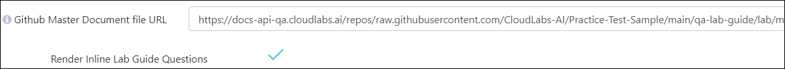
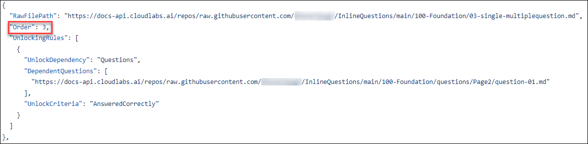
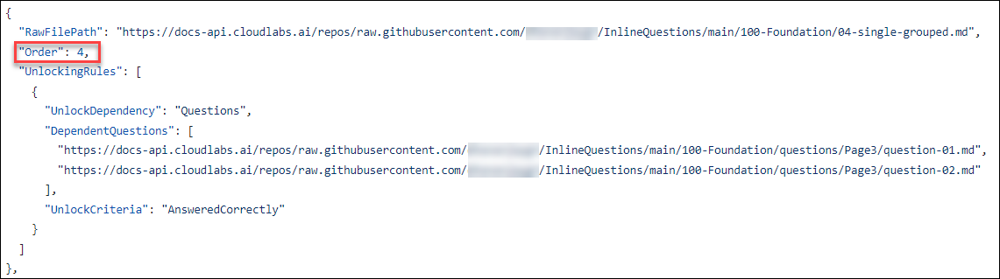

# Inline Lab Guide Question

Inline Lab Guide Questions feature provides ability to integrate an interactive Q&A module within Lab Guide.

The goal of this feature is to:

1.	Increase lab user engagement by introducing interactive elements in the lab guide. 

2.	Assess knowledge of lab user by providing questions in lab guide and grade user based on question scores. 

3.	Collection of valuable feedback from lab users to benefit both educators and CloudLabs. 

4.	Ability to force user to answer questions in current lab guide page to be able to move forward.

The feature supports two types of questions:

- **Single Choice**

- **Multiple Choice**

## Configuring OnDemand Lab with Inline Lab Guide Questions:

**Step 1: Enable Inline Questions in Template config:**

- To enable Inline Questions, we need to input master doc URL in Template config, which will make R**ender Inline Lab Guide Questions** checkbox visible.

- On tick of **Render Inline Lab Guide Questions** checkbox, the feature flag will get enabled in OnDemand lab config.

   

**Step 2: Enable Inline Questions in OnDemand lab config:**

- Once Inline Questions feature has been enabled in Template config, we need to input master doc URL in OnDemand lab config, which will make **Render Inline Lab Guide Questions** checkbox visible.

- On tick of **Render Inline Lab Guide Questions** checkbox, the Inline Questions will be rendered in Lab Guide for new deployments.

   

## FAQs:

1.	**How to enable Lab Guide questions for ongoing labs:**

    To enable Inline questions for existing labs, we just need to update the lab guide and enable ‘Render Inline Lab Guide Questions’ checkbox in the ODL config. It will take few minutes to register the questions in CloudLabs. Once questions are registered, the changes will reflect for all the new deployments or retakes.

2.	**How to update Lab Guide questions for ongoing labs:**

    In case any Inline question has been updated (Added / Modified / Removed) in the lab guide, it will be synched automatically after every 6 hours. To perform on demand sync, we can manually edit the ODL config and save it (no changes required in configuration), this will trigger an OnDemand sync of Inline questions.

Once sync has been completed, changes done on the questions will reflect on existing OR new deployments based on following rules:

1.	A new lab guide page is added – The questions on that will be available for new deployments / retakes only.

2.	A new question is added - it will be available for new deployments / retakes only.

3.	An existing question is removed - it will be removed for existing as well as new deployments / retakes.

4.	An existing question is updated, depending upon the change it will reflect for existing deployments:

    4.1.	In case Question Type / Options / Answer is updated- changes will reflect for new deployments / retakes only.

    4.2.	In Case Question Type, Options and Answer remains unchanged - The changes will reflect for existing deployments as well.

## User Lab Experience:

- Once feature has been enabled in ODL config, attendee will be able to see inline questions like below:

  

- To answer an Inline question, user need to select the appropriate option and click Submit button. 

- It is possible to group multiple questions, in that case a single Submit button will be visible to the user for all the questions in the group.

   

- Once the answer has been submitted, result will be shown instantly like below:

   
 
- In case the user submits a wrong answer, a Retry button will be visible as below:

- Retry option is available for a defined no of retries only which is configured in lab guide.

    
 
## Authoring Inline Lab Guide Questions:

Below are the files which need to be created while authoring lab guide questions:

1.	**Master Doc File -**

- This will be the parent file (Json file) which is configured in the OnDemand Lab.

- Master doc file contains list of Lab guide page files and page unlocking rules.

  ```
  [
    {
      "Name": "How to Design a Lab Guide",
      "Language": "English",
      "Files": [
        {
          "RawFilePath": "https://docs-api-qa.cloudlabs.ai/repos/raw.githubusercontent.com/CloudLabs-AI/Practice-Test-Sample/main/qa-lab-guide/lab/01-single-question.md",
          "Order": 1
        },
        {
          "RawFilePath": "https://docs-api-qa.cloudlabs.ai/repos/raw.githubusercontent.com/CloudLabs-AI/Practice-Test-Sample/main/qa-lab-guide/lab/02-multiple-question.md",
          "Order": 2,
          "UnlockingRules": [
            {
              "UnlockDependency": "Questions",
              "DependentQuestions": [ "./questions/Page1/question-01.md", "./questions/Page1/question-02.md" ],
              "UnlockCriteria": "AnsweredCorrectly"
            }
          ]
        }
      ]
    }
  ]
  ```
  
2.	**Lab Guide Page File –**

- The lab guide page file (markdown file) will contain the content to render on lab guide page, along with inline question file tags.

- To render inline questions in lab guide page below tags can be used:

  For individual questions- 	<question source="{relative question file path}" />
  For grouped questions- 	<grouped-questions source=”{relative question group file path}" />

  ```
  Please answer the following question
  <question source="../questions/Page7/question-01.md" />
  
  Please answer the following question
  <question source="../questions/Page7/question-02.md" />
  
  Please answer the following question
  <question source="../questions/Page7/question-03.md" />
  
  Please answer the following question
  <question source="../questions/Page7/question-04.md" />
  
  Please provide feedback about the lab guide
  <grouped-questions source="../questions/Page7/page-7-metadata.md" />
  
  ```

3.	**Question Metadata File –**

- The question metadata file (markdown file) will contain the question specific information required to render the question in the front end. It will also contain the correct answer and score for validation purpose and number of allowed retries to submit the answer.

  ```
  ## Metadata
  Question Type : Single Choice
  
  ## Question
  What sensitivity labels are used by the military contractor to tag content?:
  
  ## Options
  Option 1: Top Secret, Secret, Unclassified
  
  Option 2: Confidential, Unclassified, Sensitive
  
  Option 3: Secret, Confidential, Unclassified
  
  Option 4: Private, Public, Unclassified
  
  ## Answers
  Option 3 : 1
  
  ## Correct Answer Feedback
  Option 3 is correct answer
  
  ## Incorrect Answer Feedback
  Selected ## Options is not correct Option 3 is correct answer
  
  ## Tags
  tag1
  tag2
  
  ## Number of Retries
  2
  ```

  ```  
  ## Metadata
  Question Type : Multiple Choice
  
  Max Answers : 2
  
  
  ## Question
  Which severity level is assigned to the "Confidential Classification Rule" in the Wiz portal?:
  
  ## Options
  Option 1: Low
  
  Option 2: Medium
  
  Option 3: High
  
  Option 4: Critical
  
  ## Answers
  Option 2 : 1
  Option 3 : 1
  
  ## Correct Answer Feedback
  Option 2, 3 is correct answer
  
  ## Incorrect Answer Feedback
  Selected ## Options is not correct Option 2, 3 is correct answer
  
  ## Tags
  tag1
  tag2
  
  ## Number of Retries
  5
  ```
                    
- Syntax of question metadata file:

   - ### Metadata -> Question Type:
     It should one of the below values-

     Single Choice (for single choice questions) OR Multiple Choice (for multiple choice questions)

   - ### Metadata -> Max Answers:
     This field is used in case of multiple-choice questions to control the maximum number of options which can be selected by lab use on front end. The value must be an integer having 2 as minimum value OR number of available options as maximum value.

   - ### Question:
     Content placed here will be visible as question in the lab guide. Maximum 4000 characters are allowed.

   - ### Options:
     Content placed here (after :) will be visible as options in the lab guide.

     Content placed before colon (:) is not visible to lab user (It is used as an identifier for the given answers).

     Lab user can select one of more options and submit the answer.

   - ### Answers:
     Content placed here will be used by CloudLabs to validate user answer and calculate user score.

     In case of Single choice question there can be only a single answer.

     In case of Multiple-choice question there can be multiple answers (one answer each row).

     Value placed before colon (:) is the identifier of the correct answer out of given option.

     Value placed after colon (:) is the score.

   - ### Correct answer feedback:
     Upon submission of correct answer, this text will be shown to lab user in front end.

   - ### Incorrect answer feedback:
     When user submits an incorrect answer, this text will be shown to lab user in front end.

   - ### Tags:
     This field is used as a tag and currently is not displayed anywhere. You can place any value here.

   - ## Number of Retries:
     An integer value which is used to control number of allowed retries to submit the answer.

     To allow unlimited retries, set it to zero ‘0’. This field is not required in case of grouped questions.

4.	**Question Group File –**
- The question group file (markdown file) will contain the name of question files which are part of the grouped question and number of allowed retries to submit the answer.

- Syntax of question group file:

   - ## Question:
     Specify the question file names which are part of this grouped question.

   - ## Number of Retries:
     An integer value which is used to control number of allowed retries to submit the answer.

     To allow unlimited retries, set it to zero ‘0’.
  
      ```
      ## Questions
      question-05
      question-06
      
      ## Number of Retries
      5
      ```

## Page Unlocking Rules:

Below page unlocking rules can be applied in the master doc:
  
1.	**Answered** - Ensures that given list of questions have been answered by the user before proceeding further.

    ```
    "UnlockingRules": [
              {
                "UnlockDependency": "GroupedQuestions",
                "DependentQuestions": [ "./questions/Page7/page-7-metadata.md", "./questions/Page7/question-02.md" ],
                "UnlockCriteria": "Answered"
              }
            ]
    ```

2.	**Answered Correctly** - Ensures that given list of questions have been answered correctly before proceeding further.
 
    ```
    "UnlockingRules": [
              {
                "UnlockDependency": "GroupedQuestions",
                "DependentQuestions": [ "./questions/Page5/question-05.md" ],
                "UnlockCriteria": "AnsweredCorrectly"
              }
            ]
    ```

3.	**Score** - Ensures that for the given list of questions user has received the required score before proceeding further.

    ```
    "UnlockingRules": [
              {
                "UnlockDependency": "GroupedQuestions",
                "DependentQuestions": [ "./questions/Page4/page-4-metadata.md" ],
                "UnlockCriteria": "Score",
                "UnlockPercentageThreshold": 50
              }
            ]
    ```

## Example Scenarios:

1. **Scenario 01:**
   
   **Single answer questions:**
      
   >**Note:** To ensure the questions are properly synchronized with the lab guide, create a dedicated folder for questions. This will make the questions well-organized and easily accessible.

    - Here is the question Markdown used for the Single Answer Question format:

      ```
      ## Metadata
      Question Type : Single Choice
      
      ## Question
      What sensitivity labels are used by the military contractor to tag content?:
      
      ## Options
      Option 1: Top Secret, Secret, Unclassified
      
      Option 2: Confidential, Unclassified, Sensitive
      
      Option 3: Secret, Confidential, Unclassified
      
      Option 4: Private, Public, Unclassified
      
      ## Answers
      Option 3 : 1
      
      ## Correct Answer Feedback
      Option 3 is correct answer
      
      ## Incorrect Answer Feedback
      Selected ## Options is not correct Option 3 is correct answer
      
      ## Tags
      tag1
      tag2
      
      ## Number of Retries
      2
      ```

    - Now, include the question Markdown file on the first page of the lab guide.

      Here is the inline question file tag used on the first page of the lab guide.

      >**Note:** We can place question file tags wherever they're needed on the page, ensuring proper syntax is followed. Additionally, there's flexibility to include any number of questions.
      
      >**Note:** We can include the full raw question Markdown file in both the lab guide and the master document.

       

    - To incorporate the **unlocking rules** for the **first page**, the question Markdown file should be included in the **second order** of the raw file path within the Master Doc file.

      Here are the **unlocking rules** for this question: It is marked as **Answered.** Therefore, even if the answer is incorrect, it should still allow progression to the next page.           However, without attempting to answer it, progression to the next page will be blocked.

       

      Attendee will be able to see inline questions like below:

      Attendees can proceed to the next page by either answering the question correctly or incorrectly, based on the unlocking rules.

      

2. **Scenario 02:**
   
   **Multiple answers questions:**
    
    - Here is the question Markdown used for the Multiple Answers Question format:

      ```
      ## Metadata
      Question Type : Multiple Choice
      
      Max Answers : 2
      
      
      ## Question
      Which severity level is assigned to the "Confidential Classification Rule" in the Wiz portal?:
      
      ## Options
      Option 1: Low
      
      Option 2: Medium
      
      Option 3: High
      
      Option 4: Critical
      
      ## Answers
      Option 2 : 1
      Option 3 : 1
      
      ## Correct Answer Feedback
      Option 2, 3 is correct answer
      
      ## Incorrect Answer Feedback
      Selected ## Options is not correct Option 2, 3 is correct answer
      
      ## Tags
      tag1
      tag2
      
      ## Number of Retries
      5
      ```

    - Now, include the question Markdown file on the second page of the lab guide.

      Here is the inline question file tag used on the second page of the lab guide.

       

    - To include the **unlocking rules** for the **second page**, the question Markdown file should be included in the **third order** of the raw file path within the Master Doc file.

      Here are the **unlocking rules** for this question: It is marked as **AnsweredCorrectly.** Therefore, the answer should be correct to proceed to the next page.

       

      Attendee will be able to see inline questions like below:

      Attendees can proceed to the next page by answering the question correctly, based on the unlocking rules.

      

3. **Scenario 03:**
   
   **Single and Multiple answers question:**
    
    - Here is the question Markdown used for the Single and Multiple Answers Question format:

      ```
      ## Metadata
      Question Type : Single Choice
      
      ## Question
      Which of the following steps is NOT part of creating a data classification rule in the Wiz portal?:
      
      ## Options
      Option 1: Selecting the data type
      
      Option 2: Defining the severity level
      
      Option 3: Setting the maximum unique matches
      
      Option 4: Uploading the file to be classified
      
      ## Answers
      Option 4 : 1
      
      ## Correct Answer Feedback
      Option 4 is correct answer
      
      ## Incorrect Answer Feedback
      Selected ## Options is not correct Option 4 is correct answer
      
      ## Tags
      tag1
      tag2
      
      ## Number of Retries
      4
      ```
      
      ```
      ## Metadata
      Question Type : Multiple Choice
      Max Answers : 3
      
      ## Question
      What is the purpose of setting the "Minimum unique matches" field when creating a data classification rule in the Wiz portal?:
      
      ## Options
      Option 1: To determine the number of files to be scanned
      
      Option 2: To specify the minimum number of occurrences of the classified data within a single file
      
      Option 3: To control the sensitivity level of the classification rule
      
      Option 4: To prioritize the scanning of certain file types
      
      ## Answers
      Option 2 : 1
      Option 3 : 1
      
      ## Correct Answer Feedback
      Option 2, 3 is correct answer
      
      ## Incorrect Answer Feedback
      Selected ## Options is not correct Option 2, 3 is correct answer
      
      ## Tags
      tag1
      tag2
      
      ## Number of Retries
      4
      ```
    - Now, include the question Markdown file on the Third page of the lab guide.

      Here are the inline questions file tag used on the Third page of the lab guide.

       

       

    - To include the **unlocking rules** for the **Third page**, the question Markdown file should be included in the **fourth order** of the raw file path within the Master Doc file.

      Here are the **unlocking rules** for this question: It is marked as **AnsweredCorrectly.** Therefore, the answer should be correct to proceed to the next page.

       

      Attendee will be able to see inline questions like below:

      Attendees can proceed to the next page by answering the question correctly, based on the unlocking rules.

      

      

4. **Scenario 04:**
   
   **Grouped single answer questions:**
    
    - Here are the question Markdowns used for the Grouped Single Answer Questions format:

      ```
      ## Metadata
      Question Type : Single Choice
      
      ## Question
      What is the purpose of setting the "Minimum unique matches" field when creating a data classification rule in the Wiz portal?:
      
      ## Options
      Option 1: To determine the number of files to be scanned
      
      Option 2: To specify the minimum number of occurrences of the classified data within a single file
      
      Option 3: To control the sensitivity level of the classification rule
      
      Option 4: To prioritize the scanning of certain file types
      
      ## Answers
      Option 2 : 1
      
      ## Correct Answer Feedback
      Option 2 is correct answer
      
      ## Incorrect Answer Feedback
      Selected ## Options is not correct Option 2 is correct answer
      
      ## Tags
      tag1
      tag2
      
      ## Number of Retries
      5
      ```

      ```
      ## Metadata
      Question Type : Single Choice
      
      ## Question
      Which of the following steps is NOT part of creating a data classification rule in the Wiz portal?:
      
      ## Options
      Option 1: Selecting the data type
      
      Option 2: Defining the severity level
      
      Option 3: Setting the maximum unique matches
      
      Option 4: Uploading the file to be classified
      
      ## Answers
      Option 4 : 1
      
      ## Correct Answer Feedback
      Option 4 is correct answer
      
      ## Incorrect Answer Feedback
      Selected ## Options is not correct Option 4 is correct answer
      
      ## Tags
      tag1
      tag2
      
      ## Number of Retries
      5
      ```

    - Now, include the question Markdown file on the fourth page of the lab guide.

      Here is the inline question file tag used on the fourth page of the lab guide.

      >**Note:** As these are grouped questions, we need to have a **grouped Markdown file (metadata file)** in the same group where the actual questions related to this metadata are located.

       

       

       

    - To include the **unlocking rules** for the **fourth page**, the question Markdown file should be included in the **fifth order** of the raw file path within the Master Doc file.

      Here are the **unlocking rules** for this question: It is marked as Score. Therefore, the answer should be based on the **score**, and one should meet the threshold. Since there are       two questions, the combined score should meet the 50% threshold to proceed to the next page.

       

      Attendee will be able to see inline questions like below:

      The **score** will not be displayed as of now, but based on two questions and a **50% threshold**, if at least one is answered correctly, it will allow progression to the next page.

      

5. **Scenario 05:**
   
   **Grouped Multiple answers questions:**
    
    - Here are the question Markdowns used for the Grouped Multiple Answers Questions format: 

      ```
      ## Metadata
      Question Type : Multiple Choice
      Max Answers : 2
      
      ## Question
      In the context of GitHub, what does the term "fork" mean?:
      
      ## Options
      Option 1: To create a duplicate of a repository under your GitHub account
      
      Option 2: To merge changes from one branch into another
      
      Option 3: To create a new branch from an existing one
      
      Option 4: To revert changes made in a commit
      
      ## Answers
      Option 1 : 1
      Option 3 : 1
      
      ## Correct Answer Feedback
      Option 1, 3 is correct answer
      
      ## Incorrect Answer Feedback
      Selected ## Options is not correct Option 1, 3 is correct answer
      
      ## Tags
      tag1
      tag2
      
      ## Number of Retries
      5
      ```

      ```
      ## Metadata
      Question Type : Multiple Choice
      Max Answers : 2
      
      ## Question
      What is the purpose of a pull request in GitHub?:
      
      ## Options
      Option 1: To request changes to a repository
      
      Option 2: To review changes made in a branch before merging them into another branch
      
      Option 3: To undo changes made in a commit
      
      Option 4: To create a new branch from an existing one
      
      ## Answers
      Option 1 : 1
      Option 2 : 1
      
      ## Correct Answer Feedback
      Option 1, 2 is correct answer
      
      ## Incorrect Answer Feedback
      Selected ## Options is not correct Option 1, 2 is correct answer
      
      ## Tags
      tag1
      tag2
      
      ## Number of Retries
      5
      ```

    - Now, include the question Markdown file on the fifth page of the lab guide.

      Here is the inline question file tag used on the fifth page of the lab guide.

      >**Note:** As these are grouped questions, we need to have a **grouped Markdown file (metadata file)** in the same group where the actual questions related to this metadata are located.

       

       

       

    - To include the **unlocking rules** for the **fifth page**, the question Markdown file should be included in the **sixth order** of the raw file path within the Master Doc file.

      Here are the **unlocking rules** for this question: It is marked as **AnsweredCorrectly.** Therefore, the answer should be correct to proceed to the next page.

       

      Attendee will be able to see inline questions like below:

      Attendees can proceed to the next page by answering the question correctly, based on the unlocking rules.

       

6. **Scenario 06:**
   
   **Grouped Single and Multiple answers questions:**
    
    - Here are the question Markdowns used for the Grouped Single and Multiple Answers Questions format:

      ```
      ## Metadata
      Question Type : Single Choice
      
      ## Question
      What is the purpose of creating a new branch when committing changes to a GitHub repository?:
      
      ## Options
      Option 1: To separate different versions of the code
      
      Option 2: To merge changes from one branch into another
      
      Option 3: To revert changes made in a commit
      
      Option 4: To create a duplicate of a repository under your GitHub account
      
      ## Answers
      Option 2 : 1
      
      ## Correct Answer Feedback
      Option 2 is correct answer
      
      ## Incorrect Answer Feedback
      Selected ## Options is not correct Option 2 is correct answer
      
      ## Tags
      tag1
      tag2
      
      ## Number of Retries
      5
      ```

      ```
      ## Metadata
      Question Type : Single Choice
      
      ## Question
      What does the "Wiz IaC Scanner" check for during the CI/CD process?:
      
      ## Options
      Option 1: Code syntax errors
      
      Option 2: Infrastructure as Code misconfigurations
      
      Option 3: Vulnerabilities in the code
      
      Option 4: Secret keys stored in the code
      
      ## Answers
      Option 2 : 1
      
      ## Correct Answer Feedback
      Option 2 is correct answer
      
      ## Incorrect Answer Feedback
      Selected ## Options is not correct Option 2 is correct answer
      
      ## Tags
      tag1
      tag2
      
      ## Number of Retries
      5
      ```

      ```
      ## Metadata
      Question Type : Multiple Choice
      Max Answers : 2
      
      ## Question
      What action is recommended when the "Wiz Secret Scanner" fails during a pull request check?:
      
      ## Options
      Option 1: Ignore the findings and proceed with merging
      
      Option 2: Address the identified secrets in the code
      
      Option 3: Submit the pull request without addressing the issues
      
      Option 4: Revert the changes made in the pull request
      
      Option 5: Ignore the findings
      
      ## Answers
      Option 2 : 1
      Option 3 : 1
      
      ## Correct Answer Feedback
      Option 2,3 is correct answer
      
      ## Incorrect Answer Feedback
      Selected ## Options is not correct Option 2,3 is correct answer
      
      ## Tags
      tag1
      tag2
      
      ## Number of Retries
      2
      ```
      
      ```
      ## Metadata
      Question Type : Multiple Choice
      Max Answers : 2
      
      ## Question
      Why is it important to address the issues found by the Wiz scanners during the CI/CD process?:
      
      ## Options
      Option 1: To increase the number of commits in the repository
      
      Option 2: To enhance the code quality and security
      
      Option 3: To speed up the deployment process
      
      Option 4: To create more branches in the repository
      
      Option 5: To only increase the number of commits
      
      ## Answers
      Option 2 : 1
      Option 3 : 1
      
      ## Correct Answer Feedback
      Option 2,3 is correct answer
      
      ## Incorrect Answer Feedback
      Selected ## Options is not correct Option 2,3 is correct answer
      
      ## Tags
      tag1
      tag2
      
      ## Number of Retries
      2
      ```

    - Now, include the question Markdown file on the sixth page of the lab guide.

      Here is the inline question file tag used on the sixth page of the lab guide.

      >**Note:** As these are grouped questions, we need to have a **grouped Markdown file (metadata file)** in the same group where the actual questions related to this metadata are located.

       

       

       

    - To include the **unlocking rules** for the **sixth page**, the question Markdown file should be included in the **seventh order** of the raw file path within the Master Doc file.

      Here are the **unlocking rules** for this question: It is marked as **Answered.** Therefore, even if the answer is **incorrect,** it should still allow progression to the next page.       However, without attempting to answer it, progression to the next page will be blocked.

       

      Attendee will be able to see inline questions like below:

      Attendees can proceed to the next page by either answering the question correctly or incorrectly, based on the unlocking rules.

       

       

7. **Scenario 07:**
   
   **Single and Multiple answers questions:** 

   **Grouped Single and Multiple answers questions:** 
    
    - Here are the question Markdowns used for Single and Multiple Answers question format, as well as for Grouped Single and Multiple Answers question format:

      ```
      ## Metadata
      Question Type : Single Choice
      
      ## Question
      What is the purpose of the "Wiz IaC Scanner" in the CI/CD pipeline?:
      
      ## Options
      Option 1: To check for vulnerabilities in the code
      
      Option 2: To review changes made in a branch before merging them into another branch
      
      Option 3: To scan for Infrastructure as Code misconfigurations
      
      Option 4:  To revert changes made in a commit
      
      ## Answers
      Option 3 : 1
      
      ## Correct Answer Feedback
      Option 3 is correct answer
      
      ## Incorrect Answer Feedback
      Selected ## Options is not correct Option 3 is correct answer
      
      ## Tags
      tag1
      tag2
      
      ## Number of Retries
      2
      ```

      ```
      ## Metadata
      Question Type : Multiple Choice
      Max Answers : 2
      
      ## Question
      What action did the author take in response to the "Wiz IaC Scanner" finding regarding the Dockerfile?:
      
      ## Options
      Option 1: Ignored the finding and proceeded with merging
      
      Option 2: Addressed the misconfiguration in the Dockerfile
      
      Option 3: Reverted the changes made in the commit
      
      Option 4: Created a new branch to isolate the issue
      
      Option 5: Ignored the finding 
      
      
      ## Answers
      Option 1 : 1
      Option 2 : 1
      
      ## Correct Answer Feedback
      Option 1, 2 is correct answer
      
      ## Incorrect Answer Feedback
      Selected ## Options is not correct Option 1, 2 is correct answer
      
      ## Tags
      tag1
      tag2
      
      ## Number of Retries
      5
      ```

      ```
      ## Metadata
      Question Type : Single Choice
      
      ## Question
      What is the potential consequence of ignoring the findings from the "Wiz Secret Scanner"?:
      
      ## Options
      Option 1 : Increased code quality and security
      
      Option 2 : Reduced risk of compromise and privilege escalation
      
      Option 3 : Enhanced integration with the CI/CD pipeline
      
      Option 4 : Higher likelihood of exposing sensitive credentials
      
      ## Answers
      Option 4 : 1
      
      ## Correct Answer Feedback
      Option 4 is correct answer
      
      ## Incorrect Answer Feedback
      Selected ## Options is not correct Option 4 is correct answer
      
      ## Tags
      tag1
      tag2
      
      ## Number of Retries
      5
      ```
      
      ```
      ## Metadata
      Question Type : Multiple Choice
      Max Answers : 2
      
      ## Question
      Why did the author choose to merge the pull request despite the "Wiz Secret Scanner" finding?:
      
      ## Options
      Option 1: To increase the number of commits in the repository
      
      Option 2: To speed up the deployment process
      
      Option 3: To demonstrate bypassing checks in the CI/CD pipeline
      
      Option 4: To address all findings before merging
      
      ## Answers
      Option 2 : 1
      Option 3 : 1
      
      ## Correct Answer Feedback
      Option 2, 3 is correct answer
      
      ## Incorrect Answer Feedback
      Selected ## Options is not correct Option 2, 3 is correct answer
      
      ## Tags
      tag1
      tag2
      
      ## Number of Retries
      2
      ```

    - Now, include the question Markdown file on the seventh page of the lab guide.

      Here is the inline question file tag used on the seventh page of the lab guide.

      >**Note:** As these are grouped questions, we need to have a **grouped Markdown file (metadata file)** in the same group where the actual questions related to this metadata are located.

       

       

       

       

    - To include the **unlocking rules** for the **seventh page**, the question Markdown file should be included in the **eigth order** of the raw file path within the Master Doc file.

      Here are the **unlocking rules** for this question: It is marked as **Answered.** Therefore, even if the answer is **incorrect,** it should still allow progression to the next            page. However, without attempting to answer it, progression to the next page will be blocked.

       

      Attendee will be able to see inline questions like below:

      Attendees can proceed to the next page by either answering the question correctly or incorrectly, based on the unlocking rules.

       

       

       


  
     
